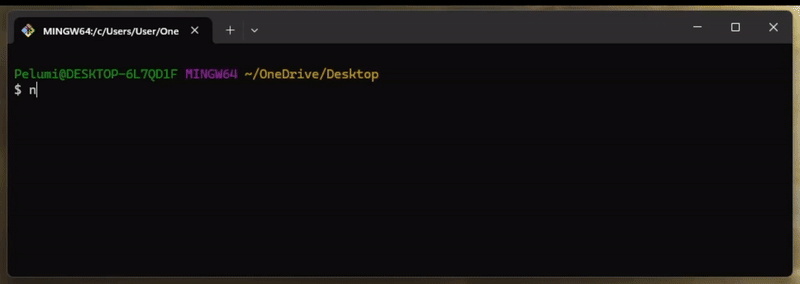
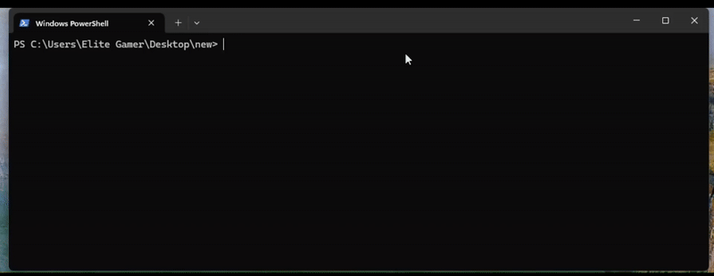

### About

This simple tool allows you to transfer file between two or more systems on the same local network.
NOTE: only use on a network you trust.

### Features:

- Sending single file and folders
- Multiple listeners(configurable)
- Sending folder as a zip

### Install

You can download an appropriate release for your system - [here](https://github.com/knightfall22/nin/releases/tag/beta)
